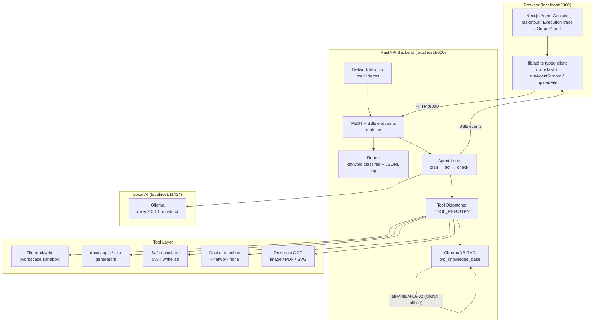
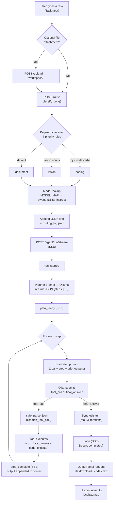
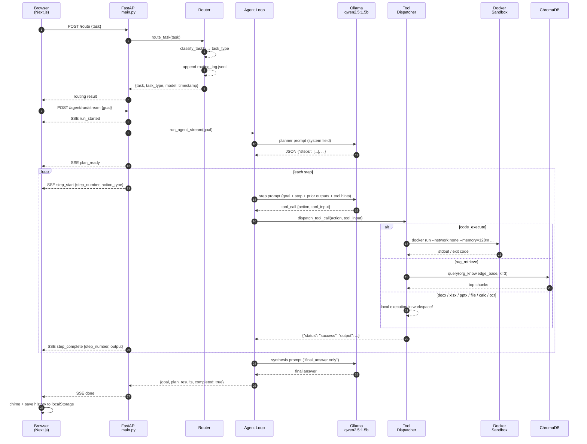
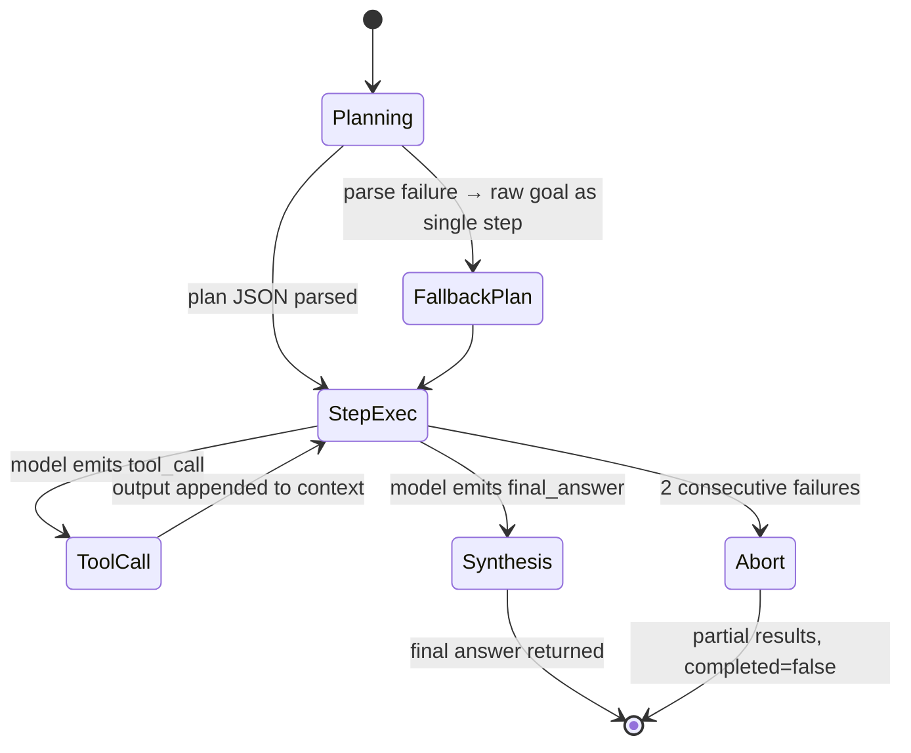
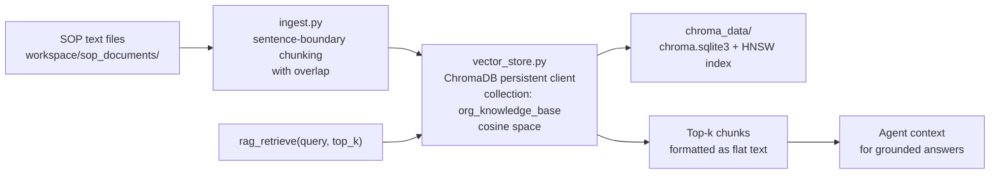

# Sovereign AI Workbench (FORTEXA)

An **industrial offline AI workbench** that takes a natural-language task — write a document, generate a spreadsheet, run code, read a scan, answer from internal SOPs — and executes it end-to-end using **only local resources**. Zero external network calls: the LLM, the embeddings, the OCR, the speech engine, and the code sandbox all run on `127.0.0.1`.

Built for **SIH 2026**. The project proves the "fully offline" claim with Wireshark captures and a live network monitor.

- **Backend** — FastAPI + Ollama + agent loop + 10-tool dispatcher + Docker sandbox + ChromaDB RAG + Tesseract OCR + Vosk STT
- **Frontend** — Next.js 16 / React 19 / Tailwind 4 single-page agent console with live SSE execution tracing
- **Proof** — Wireshark `.pcapng` captures, psutil network monitor, offline rehearsal script

---

## Table of Contents

1. [What It Does](#what-it-does)
2. [High-Level Design](#high-level-design)
3. [Request Flow (Flow Chart)](#request-flow-flow-chart)
4. [Agent Run Sequence Diagram](#agent-run-sequence-diagram)
5. [Tech Stack](#tech-stack)
6. [Open-Source Components & Licenses](#open-source-components--licenses)
7. [Backend Deep Dive](#backend-deep-dive)
8. [Frontend Deep Dive](#frontend-deep-dive)
9. [API Reference](#api-reference)
10. [Tool Catalog](#tool-catalog)
11. [Task Routing](#task-routing)
12. [RAG Pipeline](#rag-pipeline)
13. [Sandboxed Code Execution](#sandboxed-code-execution)
14. [Offline Proof & Network Monitoring](#offline-proof--network-monitoring)
15. [Directory Structure](#directory-structure)
16. [Setup & Installation](#setup--installation)
17. [Running the Stack](#running-the-stack)
18. [Configuration](#configuration)
19. [Testing](#testing)
20. [Security Notes](#security-notes)
21. [Known Limitations & Roadmap](#known-limitations--roadmap)
22. [License](#license)

---

## What It Does

Ask it anything in plain English and it plans, executes, and delivers a file or an answer:

- **Document tasks** — "Create a Word report on X" → generates a real `.docx`
- **Spreadsheet/presentation tasks** — `.xlsx`, `.csv`, `.pptx` generation
- **Coding tasks** — writes Python, runs it inside a **network-isolated Docker sandbox**, returns output
- **Vision/scan tasks** — OCRs images and PDFs with Tesseract and answers from the extracted text
- **Knowledge tasks** — retrieves grounded answers from internal SOPs via a local ChromaDB RAG store
- **Voice input** — offline Vosk speech-to-text
- **Math** — AST-whitelisted safe calculator (no `eval`)

Every run streams its plan, step-by-step tool calls, and results to the browser in real time (SSE), and the routing decision behind each task is logged to `backend/logs/routing_log.jsonl` as human-readable evidence.

---

## High-Level Design



**Key design decisions**

| Decision | Rationale |
|---|---|
| Single small model (`qwen2.5:1.5b-instruct`) for every task type | Runs on modest hardware, fully offline; `MODEL_MAP` in `config.py` makes swapping per-task models a one-line change |
| Keyword classifier instead of LLM routing | Deterministic, explainable, instant — every decision is a documented rule and logged to JSONL |
| Plan → act → check loop with a tool registry | Extensible; adding a tool = one function + one registry entry + one schema block |
| SSE (`text/event-stream`) for run progress | Live step tracing in the UI without polling or WebSockets |
| OCR pre-processing instead of a vision model | Keeps the model text-only and the stack lighter; Tesseract covers scans/PDFs |
| Docker `--network none` for code execution | Kernel-enforced isolation; no host firewall/Wi-Fi toggling required |
| ChromaDB default ONNX embeddings | Local, cached, no API key, no cloud call — verified offline at cold start |

---

## Request Flow (Flow Chart)



**Failure behavior** — the loop never raises into the HTTP layer. Tool failures return `{"status": "error", ...}` dicts; two consecutive failures abort the step path; a total Ollama outage still returns a well-formed result with `completed: false`.

---

## Agent Run Sequence Diagram



---

## Tech Stack

| Layer | Technology | Version | Role |
|---|---|---|---|
| **LLM runtime** | Ollama | local | Serves the model over HTTP at `:11434` |
| **Model** | Qwen2.5 Instruct | 1.5B | Planning, tool-calling, synthesis (single model for all task types) |
| **Backend framework** | FastAPI | 0.141.1 | REST + SSE endpoints, Pydantic validation |
| **ASGI server** | Uvicorn | 0.52.4 | Runs `main:app` |
| **Language** | Python | 3.12 | All backend logic |
| **Vector store / RAG** | ChromaDB | 1.5.9 | Persistent local store, ONNX `all-MiniLM-L6-v2` embeddings |
| **OCR** | pytesseract + Tesseract | system binary | Image/PDF/SVG text extraction |
| **PDF handling** | pypdf + pdf2image | — | PDF text and page rendering for OCR |
| **Office generation** | python-docx / python-pptx / openpyxl / xlsxwriter | — | Real `.docx` / `.pptx` / `.xlsx` / `.csv` artifacts |
| **Speech-to-text** | Vosk | offline model | `/voice/transcribe` (local, no cloud STT) |
| **Code sandbox** | Docker | `offline-code-sandbox` image | `python:3.11-slim`, non-root, `--network none`, hard resource caps |
| **Network monitor** | psutil | — | Delta-based per-second traffic stats |
| **Frontend framework** | Next.js | 16.3.3 | App Router, single-page agent console |
| **UI** | React / TypeScript | 19.2.8 / ^5 | Strict-mode typed components |
| **Styling** | Tailwind CSS | ^4 | Monochrome light theme, CSS-variable tokens |
| **UI primitives** | @base-ui/react + shadcn-style | ^1.7.0 | Badge/Button/Card/Collapsible wrappers |
| **Icons** | lucide-react | ^1.34.0 | Status conveyed by icon shape/weight |
| **Fonts** | next/font (Inter, JetBrains Mono) | — | Self-hosted, zero external fetch |
| **Offline proof** | Wireshark 4.6.8 + tshark | — | `.pcapng` evidence of zero external traffic |

---

## Open-Source Components & Licenses

The workbench is assembled entirely from open-source components. All heavyweight dependencies are **MIT / Apache-2.0 / BSD**, so there are no GPL obligations inside the shipped stack (Wireshark is GPL-2.0 but is used only as an offline-proving tool, not linked or distributed with the project).

| Component | License | Usage |
|---|---|---|
| FastAPI | MIT | Backend framework |
| Starlette | BSD-3 | ASGI toolkit (FastAPI dependency) |
| Uvicorn | BSD-3 | ASGI server |
| Pydantic | MIT | Request/response validation |
| Ollama | MIT | Local LLM runtime |
| Qwen2.5 (1.5B-Instruct) | Apache-2.0 | Local model weights |
| ChromaDB | Apache-2.0 | Vector store / RAG |
| sentence-transformers (all-MiniLM-L6-v2) | Apache-2.0 | ONNX embeddings (cached locally) |
| Tesseract OCR | Apache-2.0 | OCR engine |
| pytesseract | Apache-2.0 | Python bindings |
| Vosk | Apache-2.0 | Offline speech-to-text |
| psutil | BSD-3 | Network monitor |
| python-docx | MIT | Word generation |
| python-pptx | MIT | PowerPoint generation |
| openpyxl | MIT | Excel generation |
| XlsxWriter | BSD-2 | CSV/xlsx writer |
| Pillow | MIT-CMU (HPND) | Image processing |
| pypdf | BSD-3 | PDF text |
| pdf2image | MIT | PDF → page images for OCR |
| Next.js | MIT | Frontend framework |
| React / React DOM | MIT | UI |
| Tailwind CSS | MIT | Styling |
| TypeScript | Apache-2.0 | Language |
| lucide-react | ISC | Icons |
| @base-ui/react | MIT | Unstyled UI primitives |
| Docker Engine | Apache-2.0 | Sandbox runtime |
| Wireshark | GPL-2.0 | Offline-traffic proof (external tool, not shipped) |

The project's own source is a closed SIH 2026 submission — see [License](#license).

---

## Backend Deep Dive

### Modules

| Module | Purpose |
|---|---|
| `main.py` | FastAPI app, all 11 endpoints, CORS, SSE streaming |
| `config.py` | Single source of truth: Ollama URL, model map, generation params |
| `agent/ollama_client.py` | Ollama HTTP wrapper; defensive JSON parser (strips fences, repairs truncation, never raises) |
| `agent/schema.py` | 10-tool call schema + system-prompt builder with few-shot examples per output branch |
| `agent/dispatcher.py` | `TOOL_REGISTRY` + `register_tool()`; dispatch with `inspect.signature` filtering |
| `agent/agent_loop.py` | Plan → act → check loop; streaming and non-streaming entry points |
| `router/router.py` | Keyword task classifier + JSONL routing log |
| `tools/file_tools.py` | Sandboxed workspace read/write (`_resolve_safe` path guard) |
| `tools/docx_tools.py` / `pptx_tools.py` / `xlsx_tools.py` | Office document generators |
| `tools/calculator_tools.py` | AST-whitelisted arithmetic (no `eval`) |
| `tools/code_exec_tool.py` | Docker sandbox runner with timeout + container cleanup |
| `ocr/ocr_tools.py` | Tesseract image/PDF/SVG OCR |
| `rag/vector_store.py` / `rag/ingest.py` | ChromaDB store + sentence-boundary chunked ingestion |
| `monitor/network_monitor.py` | psutil delta-based network stats |
| `voice/speech_to_text.py` | Vosk offline transcription |

### Agent Loop



- **Planner prompt** asks for `{"steps": [...]}` with the format constraint pinned at the **end** (small models weight the tail).
- Each step prompt is assembled from the goal + current step + deduplicated prior outputs + deterministic tool hints.
- `safe_parse_json()` repairs common small-model breakage: markdown fences, literal newlines in strings (`json.loads(strict=False)`), truncated braces.
- A final **synthesis turn** (max 3 iterations) is forced into `final_answer`-only mode to break tool-call pattern-locking.
- Everything streams as SSE: `run_started` → `plan_ready` → `step_start`/`step_complete` × N → `done` / `error`.

---

## Frontend Deep Dive

| Component | Purpose |
|---|---|
| `app/page.tsx` | State hub: routing result, streaming steps, history, completion banner |
| `app/components/TaskInput.tsx` | Prompt box, drag-drop + file upload, orchestrates route → stream |
| `app/components/ExecutionTrace.tsx` | Collapsible vertical timeline of step reasoning/tool calls/output |
| `app/components/OutputPanel.tsx` | Renders text/code/file deliverable; copy/download/export |
| `app/components/Navbar.tsx` | Brand, session log drawer, new chat |
| `app/components/HistoryDrawer.tsx` | localStorage-backed session history |
| `lib/api.ts` | Typed client: `routeTask`, `runAgentStream`, `uploadFile`, `getDownloadUrl`; manual SSE parser; wire-format normalization (`action` → `action_type`) |
| `lib/export.ts` | TXT/MD/DOCX/PDF client-side exporters |
| `lib/sound.ts` | Web Audio completion chime |

**Design conventions** — strict monochrome black-and-white light theme (dark mode disabled); status conveyed by icon shape/weight rather than color; subtle ~300ms entry animations; collapsible details collapsed by default; history persisted under `fortexa_*` localStorage keys.

---

## API Reference

Base URL: `http://localhost:8000`

| Method | Path | Body | Response | Notes |
|---|---|---|---|---|
| GET | `/health` | — | `{status: "ok"}` | Liveness probe |
| GET | `/files` | — | `{files: [{filename, size_bytes, extension}]}` | Workspace inventory |
| GET | `/download/{filename}` | — | `FileResponse` (correct MIME) | Path-traversal guarded |
| POST | `/upload` | multipart `file` | `{status, filename, message}` | Saves into `workspace/` |
| GET | `/network-status` | — | `{bytes_sent, bytes_recv, timestamp}` | psutil counters |
| POST | `/generate` | `{prompt}` | `{response, model}` | Direct LLM call |
| POST | `/route` | `{task}` | `{task, task_type, model, timestamp}` | Also appends to JSONL log |
| GET | `/routing-log` | — | JSON array, newest first | Routing evidence for the demo |
| POST | `/agent/run` | `{goal}` | `{goal, plan, results[], completed}` | One-shot (non-streaming) |
| POST | `/agent/run/stream` | `{goal}` | SSE stream | Live execution tracing |
| POST | `/voice/transcribe` | multipart `file` | `{text, status}` | Offline Vosk STT |

**SSE event vocabulary** (`/agent/run/stream`)

| Event | Payload |
|---|---|
| `run_started` | `{goal}` |
| `plan_ready` | `{goal, plan: string[]}` |
| `step_start` | `{step_number, action_type, step}` |
| `step_complete` | `{step_number, action_type, output}` |
| `done` | `{goal, plan, results: AgentStep[], completed}` |
| `error` | `{event, message}` |

**Error codes** — `400` bad input, `404` missing file, `503` Ollama unreachable, `500` internal/tool failure.

---

## Tool Catalog

The dispatcher exposes **10 tools** to the model. All return a uniform `{"status": "success"|"error", "output": str}` dict, so the loop never needs per-tool special cases.

| Tool | Action | Inputs | Behavior |
|---|---|---|---|
| Read file | `file_read` | `path` | Sandboxed read from `workspace/` only |
| Write file | `file_write` | `path`, `content` | Sandboxed write, `..` traversal blocked |
| Word doc | `docx_generate` | `title`, `sections[]`, `filename?` | Real `.docx` (python-docx) |
| PowerPoint | `pptx_generate` | `title`, `slides[]`, `filename?` | Real `.pptx` |
| Spreadsheet | `xlsx_generate` | `title`, `headers[]`, `rows[][]`, `filename?` | `.xlsx` or `.csv`; forgiving row-shape normalization |
| Calculator | `calculator` | `expression` | AST whitelist: `+ - * / ** %`, parens, unary, literals. Rejects calls/names/imports |
| Code exec | `code_execute` | `code`, `timeout_seconds?` | Docker sandbox, timeout clamped to 30s max |
| RAG retrieve | `rag_retrieve` | `query`, `top_k?` | Top-k chunks from `org_knowledge_base` |
| OCR image | `ocr_extract_image` | `image_path` | Tesseract on `.png/.jpg/.jpeg/.svg` |
| OCR PDF | `ocr_extract_pdf` | `pdf_path` | pypdf text first, pdf2image+Tesseract fallback |

Tool outputs are formatted as flat readable strings ("Source: …\nContent: …") because the small model parses flat text better than nested JSON in its next reasoning step.

---

## Task Routing

`router/router.py` classifies every task with a **pure, deterministic keyword classifier** — no LLM, no latency, every decision explainable:

1. `.py` filename mention → `coding`
2. Strong coding verbs (`write a python program`, `debug`, `implement`…) → `coding`
3. Weak coding verbs + code nouns (`function`, `loop`, `code`…) → `coding`
4. Vision nouns (`image`, `scan`, `ocr`, `photo`…) → `vision`
5. Review verbs (`review`, `analyze`, `summarize`) + document hints → `document`
6. Bare code nouns → `coding`
7. Fallback → `document`

Each decision is appended to `backend/logs/routing_log.jsonl` (one JSON object per line, append mode, newest-first when served) and printed to the console — live, human-readable evidence for the demo. `MODEL_MAP` in `config.py` resolves the task type to a model; adding a new model = one new entry.

---

## RAG Pipeline



- Embeddings: ChromaDB default ONNX model `all-MiniLM-L6-v2`, cached in `~/.cache/chroma/` — **no API key, no download at runtime** (verified with `HF_HUB_OFFLINE=1` and a socket blockade).
- Chunking breaks at sentence/paragraph boundaries with overlap, so context is never lost mid-word at seams.
- Seeded with three refinery SOP documents: Corrosion Inspection, Safety Shutdown, Valve Maintenance.

---

## Sandboxed Code Execution

Agent-generated Python runs in a hardened Docker container (`offline-code-sandbox`):

```text
docker run --rm \
  --network none \        # kernel-enforced: no IP, no DNS, no LAN, no internet
  --memory=128m \         # OOM-killed (exit 137) if exceeded
  --cpus=0.5 \            # CPU throttle
  --pids-limit=64 \       # fork-bomb guard
  --user sandbox \        # non-root (UID 10001)
  --read-only \           # immutable filesystem
  --tmpfs /tmp:size=16m \ # scratch space
  -v "<host_workdir>:/sandbox" \
  offline-code-sandbox python3 /sandbox/script.py
```

- Image: `python:3.11-slim`, **standard library only** — no `pip`/`apt` steps, ~45 MB.
- Host-level timeout wrapper (Docker CLI has no `--timeout`); on Windows, killing the CLI does **not** stop the container, so the timeout path runs `docker rm -f <unique-name>`.
- Every control was verified with an adversarial test: OOM alloc loop (killed at 224 MB), CPU throttle (2.2× slower), fork bomb (blocked), infinite loop (killed at 10s, no leftovers), in-container socket probe (`Errno 101`, `gaierror -3`).

---

## Offline Proof & Network Monitoring

**The claim:** a full demo session makes **zero external network calls**. The stack conversation lives entirely on `127.0.0.1` (frontend `:3000`, backend `:8000`, Ollama `:11434`).

**Primary proof — Wireshark** (`demo_assets/`):

| Capture | Contents |
|---|---|
| `baseline_agents.pcapng` | 5 min on Wi-Fi while document/coding/OCR tasks ran — zero frames on ports 8000/3000/11434 |
| `loopback_stack.pcapng` | 40 s on Npcap Loopback — 1692/1692 packets to `127.0.0.1` only |
| `leak_test.pcapng` | Deliberate `curl https://google.com` — TLS ClientHello captured instantly, proving the filter catches real leaks |

Display filter: `not (ip.addr == 127.0.0.1 or ipv6.addr == ::1)` — hides all loopback, still surfaces anything external. The deliberate-leak capture proves the filter works in **both** directions.

**Secondary indicator — psutil monitor** (`GET /network-status`): delta-based per-second counters surfaced in the UI, plus `rehearse_demo_moment.py` to time two agent tasks before the live demo.

---

## Directory Structure

```text
C:\SIH 2026\
├── README.md                  # this file
├── .gitignore
├── backend\
│   ├── main.py                # FastAPI app + all endpoints
│   ├── config.py              # model map + generation params
│   ├── requirements.txt       # pinned deps
│   ├── test_docker_sandbox.py
│   ├── agent\
│   │   ├── ollama_client.py   # Ollama HTTP wrapper + JSON repair
│   │   ├── schema.py          # 10-tool schema + prompts
│   │   ├── dispatcher.py      # tool registry + dispatch
│   │   ├── agent_loop.py      # plan → act → check loop
│   │   ├── test_agent_loop.py
│   │   └── test_full_toolset.py
│   ├── tools\                 # file/docx/pptx/xlsx/calculator/code_exec
│   ├── router\
│   │   ├── router.py          # classifier + JSONL log
│   │   └── test_router.py
│   ├── rag\                   # vector_store.py + ingest.py + chroma_data/
│   ├── ocr\ocr_tools.py
│   ├── monitor\network_monitor.py
│   ├── voice\speech_to_text.py
│   ├── sandbox\               # Dockerfile + README
│   ├── workspace\             # generated files, uploads, sop_documents/
│   ├── logs\routing_log.jsonl # routing evidence (append-only)
│   └── backend-env\           # Python 3.12 virtualenv (gitignored)
├── frontend\
│   ├── app\
│   │   ├── page.tsx           # agent console state hub
│   │   ├── layout.tsx         # fonts + metadata
│   │   ├── globals.css        # monochrome theme
│   │   └── components\        # TaskInput, ExecutionTrace, OutputPanel, ...
│   ├── components\ui\         # shadcn-style primitives
│   ├── lib\                   # api.ts, export.ts, sound.ts, utils.ts
│   └── package.json
└── demo_assets\
    ├── WIRESHARK_PROOF.md     # offline proof runbook
    ├── baseline_agents.pcapng
    ├── loopback_stack.pcapng
    ├── leak_test.pcapng
    └── rehearse_demo_moment.py
```

---

## Setup & Installation

### Prerequisites (one-time, internet allowed)

| Tool | Why | Windows install |
|---|---|---|
| Python 3.12 | Backend | python.org installer |
| Node.js 20+ | Frontend | nodejs.org installer |
| Ollama | LLM runtime | ollama.com installer |
| Docker Desktop | Code sandbox | docker.com installer |
| Tesseract OCR | OCR | `winget install UB-Mannheim.TesseractOCR` |
| Poppler | PDF → images for OCR | `winget install oschwartz10612.Poppler` |
| Wireshark 4.6+ | Offline proof | wireshark.org installer (includes tshark + Npcap) |

### Backend

```sh
cd backend
python -m venv backend-env
backend-env\Scripts\activate          # PowerShell / cmd
pip install -r requirements.txt

ollama pull qwen2.5:1.5b-instruct     # one-time model download
docker build -t offline-code-sandbox sandbox/   # one-time sandbox image
```

### Frontend

```sh
cd frontend
npm install
```

### Optional: Voice input

Download the Vosk small English model (`vosk-model-small-en-us-0.15`) into `backend/voice/` — speech-to-text works fully offline once present.

---

## Running the Stack

Three processes, all local:

```sh
# 1. Ollama (runs as a service after install)
ollama serve

# 2. Backend
cd backend
backend-env\Scripts\activate
uvicorn main:app --reload                 # http://localhost:8000

# 3. Frontend
cd frontend
npm run dev                               # http://localhost:3000
```

Open `http://localhost:3000`, type a task, and watch the execution trace stream in.

**Smoke test the API directly:**

```sh
curl http://localhost:8000/health
curl -X POST http://localhost:8000/route -H "Content-Type: application/json" -d "{\"task\":\"create a report on valve maintenance\"}"
```

**Demo rehearsal:**

```sh
backend-env\Scripts\python.exe demo_assets\rehearse_demo_moment.py
```

---

## Configuration

All backend settings live in `backend/config.py`:

```python
OLLAMA_BASE_URL = "http://localhost:11434"
DEFAULT_MODEL   = "qwen2.5:1.5b-instruct"
MODEL_MAP       = {"coding": DEFAULT_MODEL, "document": DEFAULT_MODEL, "vision": DEFAULT_MODEL}
DEFAULT_GENERATION_PARAMS = {"temperature": 0.2, "num_predict": 1024}
OLLAMA_TIMEOUT  = 120
```

Adding a new model = add one entry to `MODEL_MAP` + `ollama pull <name>`.

The frontend backend URL lives in `frontend/lib/api.ts` (`BACKEND_URL`, default `http://localhost:8000`).

---

## Testing

No heavyweight framework — every module ships a runnable self-test under `if __name__ == "__main__":`, plus dedicated harnesses:

```sh
# Router classifier: 22 cases including ambiguous/tricky inputs
backend-env\Scripts\python.exe backend\router\test_router.py

# Agent loop: 5 goal → action-type cases
backend-env\Scripts\python.exe backend\agent\test_agent_loop.py

# Tool registry: cross-checks registry vs schema, probes each tool
backend-env\Scripts\python.exe backend\agent\test_full_toolset.py

# Sandbox smoke test
backend-env\Scripts\python.exe backend\test_docker_sandbox.py

# Frontend typecheck
cd frontend && npx tsc --noEmit
```

---

## Security Notes

- **Code execution is sandboxed** at the kernel level: `--network none`, `--read-only`, `--memory=128m`, `--cpus=0.5`, `--pids-limit=64`, non-root user, host-level timeout with guaranteed container cleanup.
- **Path traversal blocked** — all file paths resolve against `workspace/` via `_resolve_safe`, rejecting `..` components and escapes.
- **No `eval`** — the calculator parses with `ast`, whitelists safe nodes, rejects calls/names/imports (`__import__('os').system(...)` is blocked and tested).
- **All AI is local** — prompts never leave the machine; the LLM, embeddings, OCR, and STT have no cloud dependency.
- **Known hardening gaps** (open issues): permissive CORS with credentials, no auth on endpoints, unbounded upload sizes, PII in demo logs/workspace. These are acceptable for a local demo but must be fixed before any network-exposed deployment.

---

## Known Limitations & Roadmap

**Current limitations (candid)**

- All task types share one 1.5B model; multi-tool chains that require derived computation between steps are unreliable by design — demo tasks target the reliable 1–2 tool-call paths.
- Voice transcription requires the Vosk model directory to be downloaded manually.
- Client-side "DOCX" and "PDF" exports are HTML/print-based approximations; the real document formats come from the backend generators.
- No auth layer, no CI pipeline, no automated test runner yet.


---

## License

Project source: **All rights reserved — SIH 2026 submission.** Every third-party dependency remains under its own open-source license (see [Open-Source Components & Licenses](#open-source-components--licenses)).
